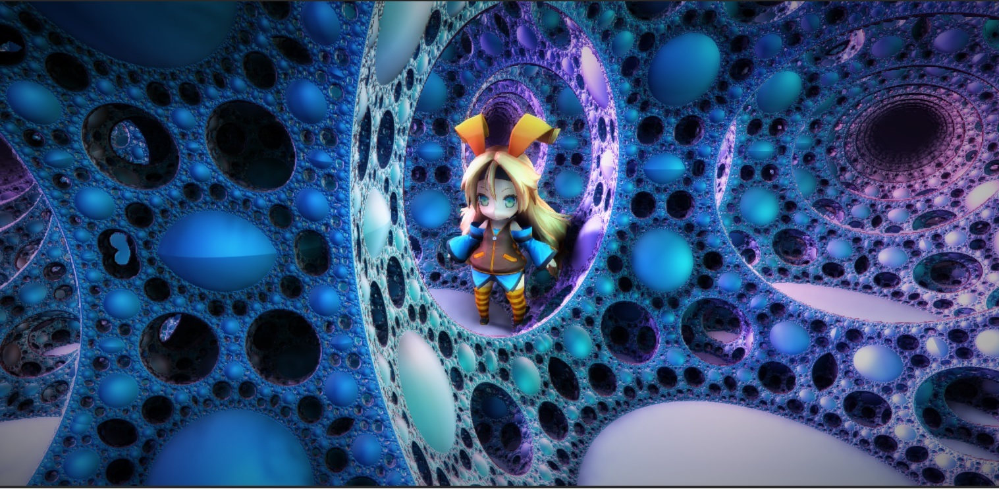

# Raymarcher for Unity3d

Generate GBuffer by distance function & raymarching and light by Unity's deferred shading pass.  

## How?

Will give answers if there is any interest.

It's just drawing two triangles.

## Building

I've just finished porting it to Unity 2020.3.0f1.

## Scenes

There are two main scenes:

### Walk around scene
This has an anime character walking around as the fractals animate around her. Shadows interact with the fractals.

### Free Roam Scene
Still working on this. Use  WASD and the mouse to move around dynamic fractal environment.
